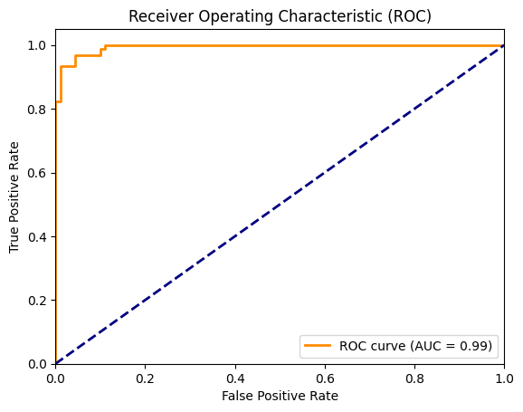
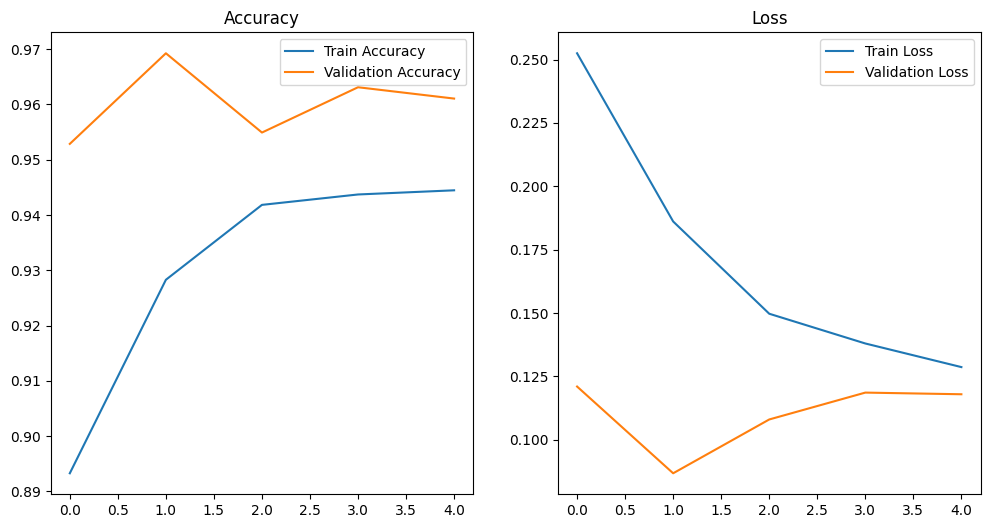

# **Dead Chicken Detection Project** 🐔💀

## **1. Introduction** 🎯
The **Dead Chicken Detection Project** is a machine learning-based solution designed to automatically detect dead chickens in poultry farms using camera feeds. The aim is to automate the detection process, improving animal welfare and farm management efficiency.

This project uses a powerful AI model to classify images of chickens as either **dead** or **alive**, helping farmers to monitor their flocks more effectively and take timely actions.

---

## **2. Features** 🌟
- **Real-time Detection**: Automatically classifies chicken images as dead or alive.
- **Efficient Model**: MobileNetV2-based model optimized for deployment on limited hardware.
- **REST API**: Exposes an endpoint to make predictions via Flask.
- **Scalable Dataset Handling**: Designed to work with large image datasets for training, validation, and testing.

---

## **3. Project Structure** 📁
The directory structure is as follows:
- **`model/dead_chicken.h5`**: The trained model used for predictions.
- **`app.py`**: Flask application that provides the API for image predictions.
- **`dead_chicken_model_v1.ipynb`**: Contains the full training and evaluation process of the model.
- **`Pipfile`** and **`requirements.txt`**: For managing project dependencies.

---

## **4. Installation** 🛠️
Follow these steps to set up and run the project locally:

### **Prerequisites** 🖥️
- Python 3.8 or later
- pip (Python package installer)
- Virtual environment tool (e.g., `pipenv` or `virtualenv`)

### **Steps** 🚀
1. **Clone the Repository**:
   ```bash
   git clone https://github.com/AIdotyam/ML.git
   cd ML
   ```
2. **Set Up Virtual Environment**: Using `pipenv`:
   ```bash
   pipenv install
   pipenv shell
   ```
   Or using `virtualenv`:
   ```bash
   python -m venv venv
   source venv/bin/activate  # For Linux/Mac
   venv\Scripts\activate     # For Windows
   ```

3. **Install Dependencies**: Install required libraries:
   ```bash
   pip install -r requirements.txt
   ```

4. **Run the Flask Application**: Start the Flask server:
   ```python
   python app.py
   ```
   The API will be available at `http://127.0.0.1:5000`.

---

## **5. Dataset 📊**
### **Source 🌍**
The dataset for training, validation, and testing was sourced from [Roboflow-hen-datasets](https://universe.roboflow.com/v1-tgwsx/hen-v2-dh1mf/dataset/1).

- **Training Set**: 6,292 images
- **Validation Set**: 592 images
- **Test Set**: 196 images

### **Structure 🗂️**
The dataset contains two classes:
- `dead`: Images of dead chickens.
- `alive`: Images of live chickens.

Images have been preprocessed and augmented to enhance model robustness.

---

# 6. Model Architecture 🧠

The model uses transfer learning based on the MobileNetV2 architecture. It was further customized for binary classification (`dead` vs. `alive`) using additional layers.

## Model Steps 🔧

### Base Model:
- Pretrained MobileNetV2 model on ImageNet, using only the convolutional base (excluding fully connected layers).

### Custom Layers:
- Added a Global Average Pooling (GAP) layer.
- A fully connected layer with ReLU activation.
- A Dropout layer to reduce overfitting.
- A dense output layer with sigmoid activation for binary classification.

### Training Strategy:
- **Initial Training**: Freeze the base layers and train the custom layers.
- **Fine-tuning**: Unfreeze selected base layers and fine-tune the model on the dataset.

## Metrics and Performance 📈
- **Accuracy**: Evaluated on the test set to check generalization.
- **AUC (Area Under Curve)**: Measured for classification performance.

---

# 7. API Documentation 🌐

The Flask API exposes an endpoint for making predictions:

## Endpoint 🔑
- **URL**: `/predict`
- **Method**: `POST`

### Request 📸
Send an image file in the request using `multipart/form-data`.

Example using curl:

```bash
curl -X POST -F file=@test_image.jpg http://127.0.0.1:5000/predict
```

### Response 📨
The API will return a JSON response with the classification result:

```json
{
  "dead_chicken": true
}
```
- `dead_chicken`: `true` if the chicken is dead, `false` if alive.

---

# 8. Results 🏆

## Model Performance 📊
- **Training Accuracy**: ~98%
- **Validation Accuracy**: ~95%
- **Test Accuracy**: ~93%
- **AUC**: 0.99

### Visualizations 📈
- **ROC Curve**: Shows the model's trade-off between true positive rate and false positive rate.

- **Training vs. Validation Accuracy/Loss**: Plots to track the model's learning progress and detect overfitting.


---

# 9. Usage 💡

This system is designed to be easily integrated with AI.YAM or other platforms. Here’s an example workflow:

1. Upload images or connect camera feeds to the API.
2. The system classifies the images and provides predictions of whether the chickens are dead or alive.
3. Display the results in real-time or store them in a database for further analysis.

---

# 10. Dependencies 📦

The project requires the following Python libraries:
- **TensorFlow** - for training the model.
- **Flask** - for serving the API.
- **Pillow** - for image processing.
- **NumPy** - for numerical computations.
- **Matplotlib** - for visualizations.
- **OpenCV** - for additional image preprocessing.
- **pandas** - for handling datasets.

To install all dependencies:

```bash
pip install -r requirements.txt
```

---

# 11. License 📜
This project is licensed under the MIT License. See the [LICENSE](LICENSE) file for more details.


---

# 12. Acknowledgements 🙏
- Roboflow for providing the dataset.
- The open-source community for the tools and frameworks used, including TensorFlow and Flask.
lua